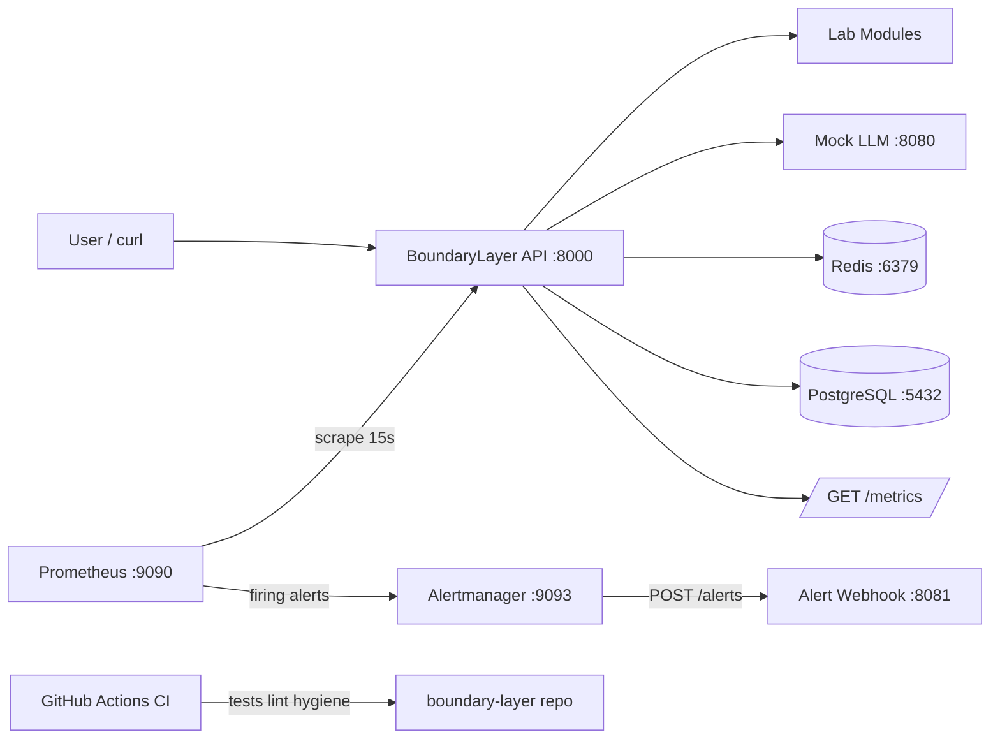
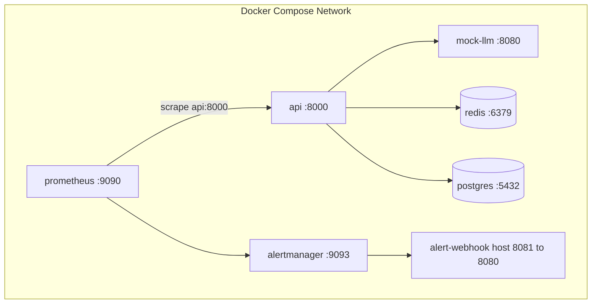
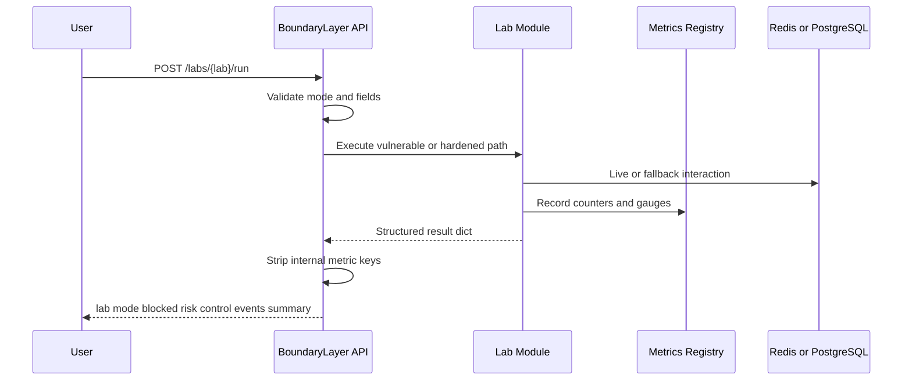
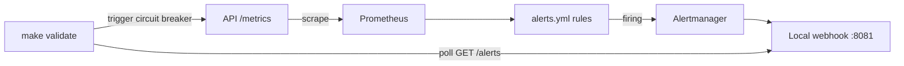
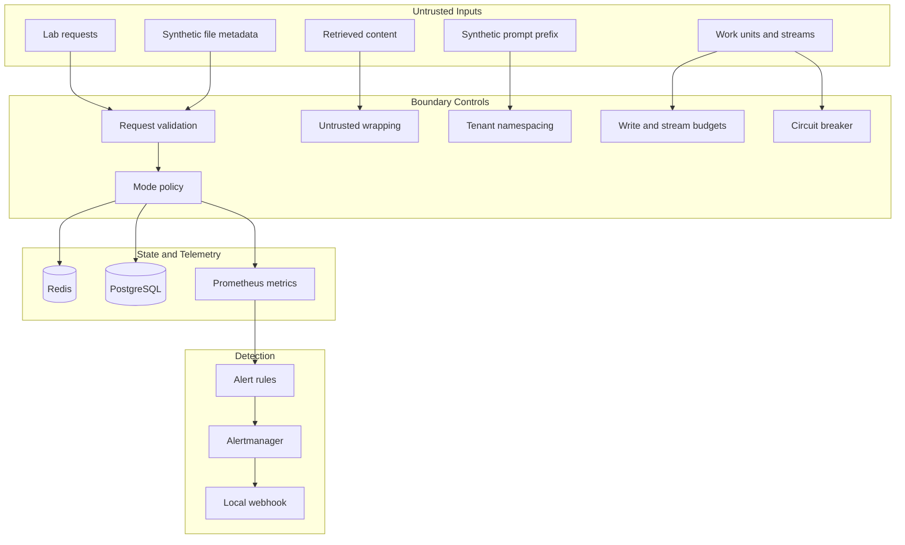

# BoundaryLayer

<p align="center">
  
</p>


**An open LLM infrastructure security lab**

The model is only the interpreter. The boundary decides the blast radius.

**Repository:** https://github.com/codethor0/boundary-layer

## Start Here

**What is BoundaryLayer?** A local defensive AI infrastructure security lab. It simulates what happens *after* a model is tricked: tool routing, session state, authorization, uploads, data lifecycle, write pressure, streaming, backpressure, cache isolation, and alert delivery.

**Who should use it?** Platform engineers, security/DevSecOps teams, AI builders, and educators who want hands-on practice with infrastructure boundaries—not just prompt injection demos.

**What does it teach?** Each lab runs in `vulnerable` or `hardened` mode so you can compare unsafe defaults to defensive controls, with Prometheus metrics and local Alertmanager delivery.

**Fastest path (about 5 minutes):**

```bash
git clone https://github.com/codethor0/boundary-layer.git
cd boundary-layer
make setup
make up
make validate
```

**Try one lab pair first (Redis tampering):**

```bash
curl -sf -X POST http://localhost:8000/labs/redis/run \
  -H "Content-Type: application/json" -d '{"mode":"vulnerable"}'
curl -sf -X POST http://localhost:8000/labs/redis/run \
  -H "Content-Type: application/json" -d '{"mode":"hardened"}'
curl -sf http://localhost:8000/metrics | grep boundary_layer_redis
```

**Trigger a local alert (circuit breaker):**

```bash
curl -sf -X DELETE http://localhost:8081/alerts
curl -sf -X POST http://localhost:8000/labs/circuit-breaker/run \
  -H "Content-Type: application/json" -d '{"mode":"hardened"}'
# Wait up to 60 seconds, then:
curl -sf http://localhost:8081/alerts
```

For a facilitator-led walkthrough, see [docs/WORKSHOP.md](docs/WORKSHOP.md). For full terminal examples, see [docs/EXAMPLES.md](docs/EXAMPLES.md).

### What you should see

`GET /health`:

```json
{"status":"ok","service":"boundary-layer-api","version":"1.3.3","environment":"development"}
```

Redis vulnerable (`blocked: false`):

```json
{"lab":"redis","mode":"vulnerable","blocked":false,"summary":"Vulnerable mode accepted a tampered Redis session blob; role escalated from viewer to admin."}
```

Redis hardened (`blocked: true`):

```json
{"lab":"redis","mode":"hardened","blocked":true,"control":"HMAC session integrity verification","summary":"Hardened mode rejected tampered Redis session; privilege escalation blocked."}
```

Webhook after circuit breaker (abbreviated):

```json
{"count":1,"alerts":[{"labels":{"alertname":"BoundaryLayerInferenceCircuitBreakerOpen"}}]}
```

BoundaryLayer is a **local lab**, not a hosted production SaaS. Do not expose the default dev stack to the public internet.

## Documentation Map

| If you want to… | Read |
|-----------------|------|
| Run your first lab in 5–30 minutes | [docs/WORKSHOP.md](docs/WORKSHOP.md) or [docs/DEMO.md](docs/DEMO.md) |
| See copy-paste curl examples and sample JSON | [docs/EXAMPLES.md](docs/EXAMPLES.md) |
| Understand services, metrics, and lab behavior | [docs/ARCHITECTURE.md](docs/ARCHITECTURE.md) |
| Review threats and trust boundaries | [docs/THREAT_MODEL.md](docs/THREAT_MODEL.md) |
| Map labs to controls and alert rules | [docs/CONTROLS_MAP.md](docs/CONTROLS_MAP.md) |
| Run safe local red-team scenarios | [docs/RED_TEAM_PLAYBOOK.md](docs/RED_TEAM_PLAYBOOK.md) |
| Use the production-like local validation profile | [docs/PRODUCTION.md](docs/PRODUCTION.md) |
| Run the full Docker validation gate | [docs/E2E_VALIDATION.md](docs/E2E_VALIDATION.md) |
| Release, tag, or publish (maintainers) | [CHANGELOG.md](CHANGELOG.md), [docs/RELEASE_CHECKLIST.md](docs/RELEASE_CHECKLIST.md), [docs/GITHUB_RELEASE.md](docs/GITHUB_RELEASE.md) |
| Browse diagrams | [docs/DIAGRAMS.md](docs/DIAGRAMS.md) or the architecture section below |

Optional deep dives: [docs/DEEP_QA.md](docs/DEEP_QA.md), [docs/LIVE_RELEASE_GATE.md](docs/LIVE_RELEASE_GATE.md), [docs/GOVERNANCE_MODEL.md](docs/GOVERNANCE_MODEL.md), [docs/BACKUP_RESTORE.md](docs/BACKUP_RESTORE.md).

## What BoundaryLayer Is

BoundaryLayer is a local LLM infrastructure security lab. It simulates the blast radius around LLM applications after the model is tricked: tool routing, session state, authorization, file handling, data lifecycle, write pressure, streaming, inference backpressure, cache isolation, and alert delivery.

It runs as a Docker Compose stack with a FastAPI orchestrator, live Redis and PostgreSQL integrations, Prometheus metrics, and Alertmanager routing to a local webhook. There is no external LLM API dependency.

BoundaryLayer includes a deterministic **mock LLM** service (`mock-llm:8080`) for local demos and extension points. Current lab runners are deterministic and mostly execute **in-process** so they remain fast, repeatable, and safe. Where labs use live infrastructure, they use Redis and PostgreSQL directly—they do not call the mock LLM HTTP API during normal lab runs.

## Why It Exists

Most AI security demos stop at prompt injection. Real failures happen at infrastructure boundaries: retrieval, caches, auth, uploads, databases, streams, and observability. BoundaryLayer provides paired vulnerable and hardened lab modes with metrics and local alert validation so engineers can practice detection and control design without production risk.

## What It Simulates

Nine deterministic labs cover infrastructure-level risks. Each lab accepts `{"mode": "vulnerable"}` or `{"mode": "hardened"}` and returns structured JSON with `lab`, `mode`, `blocked`, `risk`, `control`, `events`, and `summary`.

Focus areas include tool routing, Redis session integrity, flat authorization, file sandbox hardening, prompt governance, PostgreSQL write storms, circuit breaker backpressure, SSE exhaustion, and prompt cache isolation.

## What It Does Not Do

- It does not call paid external LLM APIs
- It does not parse real uploaded files with external parsers
- It does not reproduce confirmed production exploits
- It does not route alerts to external on-call systems by default
- It is not a production security product or WAF replacement

BoundaryLayer is for defensive education, secure engineering, and controlled local testing only.

## Production Deployment (production-like profile, v1.3.3)

BoundaryLayer ships a **production-like local validation profile** (`docker-compose.prod.yml`) for defensive testing on machines you control. It is **not** a hosted SaaS product and is **not** intended for direct public internet exposure without your own operational hardening.

The default dev stack (`make up`) remains a local-only lab with auth disabled.

```bash
cp .env.production.example .env.production
bash deploy/nginx/generate-certs.sh
make prod-up
```

See [docs/PRODUCTION.md](docs/PRODUCTION.md) for full deployment guidance.

Backup and restore scripts exist for the production-like profile, but validation currently proves **table-scoped** recovery for `write_storm_events` only—not a full fresh-volume database disaster recovery simulation. See [docs/BACKUP_RESTORE.md](docs/BACKUP_RESTORE.md).

## Architecture at a Glance

BoundaryLayer runs as a local Docker Compose lab with API, mock LLM, Redis, PostgreSQL, Prometheus, Alertmanager, and a local alert webhook.

<details>
<summary>System Architecture</summary>



Note: the mock LLM appears in the topology for demos and future extension. Lab runners execute in-process and use Redis/PostgreSQL where live mode is enabled; they do not call mock-llm during normal lab runs.

</details>

<details>
<summary>Docker Compose Runtime Topology</summary>



Note: `API --> Mock` shows the optional mock LLM companion service. Normal lab execution stays in-process inside the API container.

</details>

<details>
<summary>Lab Execution Flow</summary>



</details>

<details>
<summary>Observability and Alerting Pipeline</summary>



</details>

<details>
<summary>Trust Boundary Model</summary>



</details>

For the full diagram set (13 diagrams including per-lab flows and CI validation), see [docs/DIAGRAMS.md](docs/DIAGRAMS.md). Service ports, metrics, and lab behavior are documented in [docs/ARCHITECTURE.md](docs/ARCHITECTURE.md).

## Labs Included

| Lab | Endpoint | Risk |
|-----|----------|------|
| Tool Router Injection | `POST /labs/tool-router/run` | Retrieval poisoning routes to destructive tools |
| Redis State Tampering | `POST /labs/redis/run` | Unsigned session blobs allow privilege escalation |
| Flat AuthN/AuthZ | `POST /labs/authz/run` | Broad tokens access restricted tools |
| File Upload Injection | `POST /labs/file-upload/run` | Unsafe extraction vs sandboxed extraction |
| Prompt Governance | `POST /labs/governance/run` | Incomplete deletion orphans downstream records |
| PostgreSQL Write Storm | `POST /labs/postgres-write-storm/run` | Runaway prompt logging saturates PostgreSQL writer |
| Circuit Breaker | `POST /labs/circuit-breaker/run` | Unbounded inference work without backpressure |
| SSE Exhaustion | `POST /labs/sse-exhaustion/run` | Unbounded SSE streams exhaust workers and memory |
| Prompt Cache Isolation | `POST /labs/prompt-cache-isolation/run` | Shared prompt-prefix cache keys bleed across tenants |

Example:

```bash
curl -sf -X POST http://localhost:8000/labs/redis/run \
  -H "Content-Type: application/json" \
  -d '{"mode":"hardened"}'
```

## Live Infrastructure Components

| Service | Port | Role |
|---------|------|------|
| API | 8000 | FastAPI lab orchestrator and `/metrics` exporter |
| Mock LLM | 8080 | Deterministic model simulator (demos/extension; labs do not call it by default) |
| Redis | 6379 | Live session and cache target for Redis and prompt cache labs |
| PostgreSQL | 5432 | Live governance and write storm backend |
| Prometheus | 9090 | Scrapes metrics, evaluates alert rules |
| Alertmanager | 9093 | Routes firing alerts to local webhook |
| Alert webhook | 8081 | Stores Alertmanager payloads for validation |

Copy `.env.example` to `.env` for local overrides. Never commit `.env`.

## Observability and Alerts

The API exposes Prometheus metrics at `GET /metrics`. Lab runs increment `boundary_layer_lab_runs_total` and mode-specific counters. Prometheus evaluates rules in `detections/prometheus/alerts.yml` (including tool injection, Redis tamper, authz denial, governance, write storm, circuit breaker, SSE, prompt cache, and file upload alerts) and sends firing alerts to Alertmanager. Alertmanager routes to the local webhook at `http://localhost:8081/alerts`.

```bash
curl -sf http://localhost:8000/metrics | head -40
curl -sf http://localhost:8081/alerts
```

See [docs/CONTROLS_MAP.md](docs/CONTROLS_MAP.md) for lab-to-alert mapping.

## End-to-End Validation

The authoritative local gate is `make validate` (184 tests, lint, all labs, metrics, alert delivery including `BoundaryLayerInferenceCircuitBreakerOpen`).

```bash
make validate
```

See [docs/E2E_VALIDATION.md](docs/E2E_VALIDATION.md), [docs/LIVE_RELEASE_GATE.md](docs/LIVE_RELEASE_GATE.md), and [docs/DEEP_QA.md](docs/DEEP_QA.md) for deeper gates. Terminal examples: [docs/EXAMPLES.md](docs/EXAMPLES.md).

## Visual Identity

Logo assets live in [assets/logo/](assets/logo/README.md). The selected mark is a strata conduit stack derived from [Concept A](assets/logo/CONCEPT_REVIEW.md). SVG mark, wordmark, light and dark logos, and a social preview card are included.

## Repository Hygiene

Generated reports, command transcripts, local bundles, editor files, and build prompts are intentionally excluded from Git. They may exist locally or inside review bundles (`make bundle`), but they are not part of the public repository.

## Commands

| Target | Description |
|--------|-------------|
| `make setup` | Create virtualenv and install dependencies |
| `make up` | Build and start Docker Compose services |
| `make down` | Stop Docker Compose services |
| `make test` | Run pytest (184 tests) |
| `make validate-e2e` | Full test + lint + prod + local validation |
| `make backup` | Backup Postgres to `backups/postgres/` |
| `make validate-prod` | Run production stack validation (requires `.env.production`) |
| `make lint` | Run ruff lint and format checks |
| `make validate` | Full validation pipeline |
| `make bundle` | Create local review ZIP in `~/Downloads/` |
| `make clean` | Stop services and remove generated caches |

## Continuous Integration

GitHub Actions runs on every push and pull request to `main`: `make test`, `make lint`, repository hygiene checks, secret scanning, and logo SVG validation. Workflow: [.github/workflows/ci.yml](.github/workflows/ci.yml).

Full Docker stack validation remains available locally and through the manual [Docker Validate](.github/workflows/docker-validate.yml) workflow.

## Who It Is For

- Platform engineers
- Security and DevSecOps teams
- AI startup builders
- Red and blue teams
- Students and compliance teams

## Contributing

See [CONTRIBUTING.md](CONTRIBUTING.md). Run `make validate` locally before release or Docker-related changes.

## Security

See [SECURITY.md](SECURITY.md) and [SECURITY_NOTES.md](SECURITY_NOTES.md).

## Release

- [CHANGELOG.md](CHANGELOG.md) — release history (tag `v1.3.3` exists; GitHub Release page may still be pending)
- [docs/RELEASE_CHECKLIST.md](docs/RELEASE_CHECKLIST.md)
- [docs/GITHUB_RELEASE.md](docs/GITHUB_RELEASE.md)

## License

MIT License. See [LICENSE](LICENSE).
