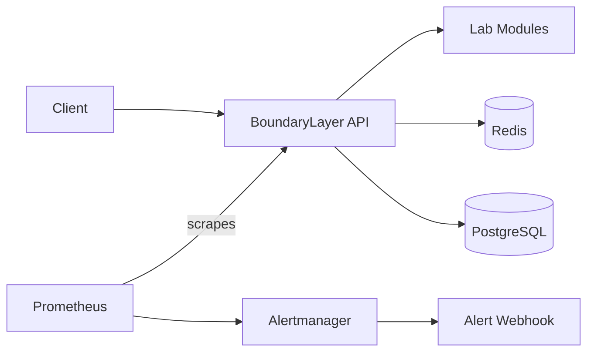

# BoundaryLayer


**An open LLM infrastructure security lab**

The model is only the interpreter. The boundary decides the blast radius.

## Description

BoundaryLayer is an open-source local security lab for simulating, detecting, and hardening infrastructure-level risks in LLM applications. Most AI security demos stop at prompt injection. BoundaryLayer asks what happens after the model gets tricked: tool routing, session state, authorization, file extraction, data lifecycle, write pressure, streaming, inference backpressure, cache isolation, and alert delivery.

**Repository:** https://github.com/codethor0/boundary-layer

**Documentation:** [Demo walkthrough](docs/DEMO.md) | [Terminal examples](docs/EXAMPLES.md) | [Architecture diagrams](docs/DIAGRAMS.md) | [Controls map](docs/CONTROLS_MAP.md)

## Try it in 5 minutes

```bash
git clone https://github.com/codethor0/boundary-layer.git
cd boundary-layer
make setup
make up
make validate
```

## Demo path

1. Run Redis vulnerable mode.
2. Run Redis hardened mode.
3. Trigger the circuit breaker alert.
4. View alert webhook delivery.

See [docs/DEMO.md](docs/DEMO.md) for step-by-step commands.

## Repository hygiene

Generated reports, command transcripts, local bundles, editor files, and build prompts are intentionally excluded from Git. They may exist locally or inside review bundles, but they are not part of the public repository.

## Why this exists

LLM applications fail at boundaries: retrieval, caches, auth, uploads, databases, streams, and observability. BoundaryLayer provides deterministic local labs that show vulnerable behavior and hardened controls side by side, with Prometheus metrics and Alertmanager routing for detection practice.

## Who it is for

- Platform engineers
- Security and DevSecOps teams
- AI startup builders
- Red and blue teams
- Students and compliance teams

## Requirements

- Python 3.12+
- Docker and Docker Compose
- macOS or Linux recommended for local validation

## Quick start

```bash
git clone https://github.com/codethor0/boundary-layer.git
cd boundary-layer
make setup
make up
make validate
```

**Services**

| Service | URL |
|---------|-----|
| API | http://localhost:8000 |
| Mock LLM | http://localhost:8080 |
| Alert webhook | http://localhost:8081 |
| Prometheus | http://localhost:9090 |
| Alertmanager | http://localhost:9093 |

Copy `.env.example` to `.env` for local overrides. Never commit `.env`.

BoundaryLayer does not require proprietary IDE tooling, external LLM APIs, or external alert integrations. Generated validation reports and command transcripts are intentionally excluded from Git and are included only in local release bundles.

## Architecture

See [docs/DIAGRAMS.md](docs/DIAGRAMS.md) for full Mermaid diagrams. At a high level:



See [docs/ARCHITECTURE.md](docs/ARCHITECTURE.md) for service ports, metrics, and lab behavior.

## Labs

| Lab | Endpoint | Risk |
|-----|----------|------|
| Tool Router Injection | `POST /labs/tool-router/run` | Retrieval poisoning routes to destructive tools |
| Redis State Tampering | `POST /labs/redis/run` | Unsigned session blobs allow privilege escalation |
| Flat AuthN/AuthZ | `POST /labs/authz/run` | Broad tokens access restricted tools |
| File Upload Injection | `POST /labs/file-upload/run` | Unsafe extraction vs sandboxed extraction |
| Prompt Governance | `POST /labs/governance/run` | Incomplete deletion orphans downstream records |
| PostgreSQL Write Storm | `POST /labs/postgres-write-storm/run` | Runaway prompt logging saturates PostgreSQL writer |
| Circuit Breaker | `POST /labs/circuit-breaker/run` | Unbounded inference work without backpressure |
| SSE Exhaustion | `POST /labs/sse-exhaustion/run` | Unbounded SSE streams exhaust workers and memory |
| Prompt Cache Isolation | `POST /labs/prompt-cache-isolation/run` | Shared prompt-prefix cache keys bleed across tenants |

Each lab accepts `{"mode": "vulnerable"}` or `{"mode": "hardened"}`. Several labs accept optional parameters for batch size, streams, tenants, or file metadata. See lab READMEs under `labs/` for details.

Example:

```bash
curl -sf -X POST http://localhost:8000/labs/redis/run \
  -H "Content-Type: application/json" \
  -d '{"mode":"hardened"}'
```

## Commands

| Target | Description |
|--------|-------------|
| `make setup` | Create virtualenv and install dependencies |
| `make up` | Build and start Docker Compose services |
| `make down` | Stop Docker Compose services |
| `make test` | Run pytest (149 tests) |
| `make lint` | Run ruff lint and format checks |
| `make validate` | Full validation pipeline |
| `make bundle` | Create local review ZIP in `~/Downloads/` |
| `make clean` | Stop services and remove generated caches |

## Continuous integration

GitHub Actions runs on every push and pull request to `main`:

- `make test` (149 tests)
- `make lint`
- Repository hygiene checks (no tracked `.cursor/`, generated reports, or prompt artifacts)
- Secret pattern scan on source files

Workflow: [.github/workflows/ci.yml](.github/workflows/ci.yml)

Full Docker stack validation (`make up`, `make validate`, Alertmanager delivery) remains available locally and through the manual [Docker Validate](.github/workflows/docker-validate.yml) workflow. Local `make validate` is authoritative for release readiness.

Do not commit generated validation reports, command transcripts, prompt artifacts, or editor tooling files. Those belong in local ZIP bundles only (`make bundle`).

## Metrics and alerts

The API exposes Prometheus metrics at `GET /metrics`. Lab runs increment `boundary_layer_lab_runs_total` and mode-specific counters. Prometheus evaluates rules in `detections/prometheus/alerts.yml` and sends firing alerts to Alertmanager. Alertmanager routes to the local webhook at `http://localhost:8081/alerts` for validation.

```bash
curl -sf http://localhost:8000/metrics | head -40
curl -sf http://localhost:8081/alerts
```

See [docs/CONTROLS_MAP.md](docs/CONTROLS_MAP.md) for lab-to-alert mapping.

## What this project does not do

- It does not call paid external LLM APIs
- It does not parse real uploaded files with external parsers
- It does not reproduce confirmed production exploits
- It does not route alerts to external on-call systems by default
- It is not a production security product or WAF replacement

BoundaryLayer is for defensive education, secure engineering, and controlled local testing only.

## Contributing

See [CONTRIBUTING.md](CONTRIBUTING.md). CI runs `make test` and `make lint` on pull requests. Run `make validate` locally before release or Docker-related changes.

## Security

See [SECURITY.md](SECURITY.md) for the security policy and [SECURITY_NOTES.md](SECURITY_NOTES.md) for local-use assumptions.

## Release

- [CHANGELOG.md](CHANGELOG.md) — version history
- [docs/RELEASE_CHECKLIST.md](docs/RELEASE_CHECKLIST.md) — pre-release checklist
- [docs/GITHUB_RELEASE.md](docs/GITHUB_RELEASE.md) — push and tag guide

Local review bundles (`make bundle`) may include validation logs and test output. Those generated files are not committed to this repository.

## License

MIT License. See [LICENSE](LICENSE).
