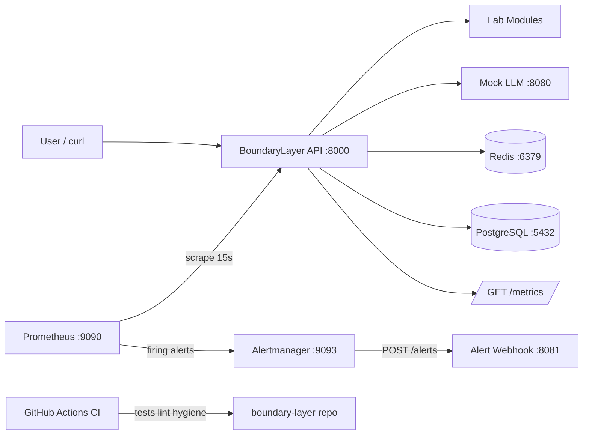
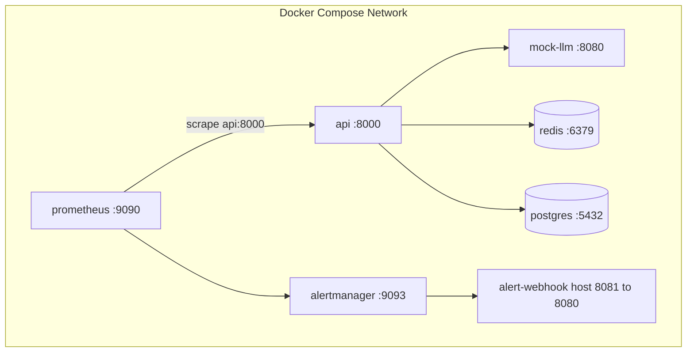
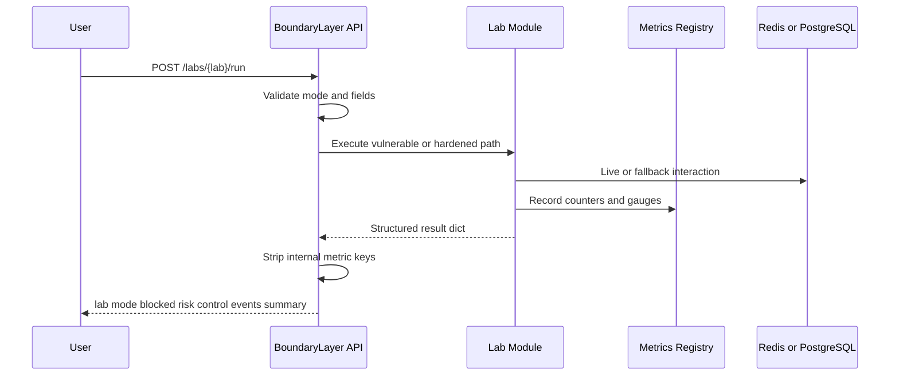
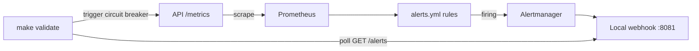
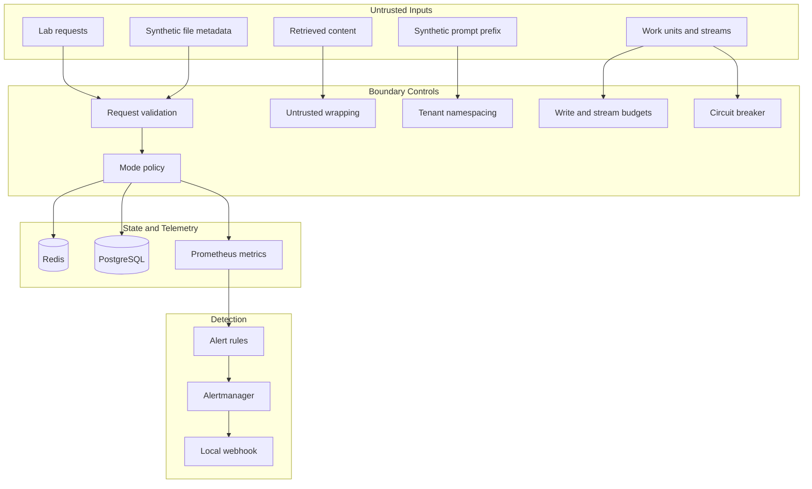

# BoundaryLayer

<p align="center">
  
</p>


**An open LLM infrastructure security lab**

The model is only the interpreter. The boundary decides the blast radius.

**Repository:** https://github.com/codethor0/boundary-layer

## What BoundaryLayer Is

BoundaryLayer is a local LLM infrastructure security lab. It simulates the blast radius around LLM applications after the model is tricked: tool routing, session state, authorization, file handling, data lifecycle, write pressure, streaming, inference backpressure, cache isolation, and alert delivery.

It runs as a Docker Compose stack with a FastAPI orchestrator, deterministic mock LLM, live Redis and PostgreSQL integrations, Prometheus metrics, and Alertmanager routing to a local webhook. There is no external LLM API dependency.

## Why It Exists

Most AI security demos stop at prompt injection. Real failures happen at infrastructure boundaries: retrieval, caches, auth, uploads, databases, streams, and observability. BoundaryLayer provides paired vulnerable and hardened lab modes with metrics and local alert validation so engineers can practice detection and control design without production risk.

## What It Simulates

Nine deterministic labs cover infrastructure-level risks. Each lab accepts `{"mode": "vulnerable"}` or `{"mode": "hardened"}` and returns structured JSON with `lab`, `mode`, `blocked`, `risk`, `control`, `events`, and `summary`.

Focus areas include tool routing, Redis session integrity, flat authorization, file sandbox hardening, prompt governance, PostgreSQL write storms, circuit breaker backpressure, SSE exhaustion, and prompt cache isolation.

## What It Does Not Do

- It does not call paid external LLM APIs
- It does not parse real uploaded files with external parsers
- It does not reproduce confirmed production exploits
- It does not route alerts to external on-call systems by default
- It is not a production security product or WAF replacement

BoundaryLayer is for defensive education, secure engineering, and controlled local testing only.

## Architecture at a Glance

BoundaryLayer runs as a local Docker Compose lab with API, mock LLM, Redis, PostgreSQL, Prometheus, Alertmanager, and a local alert webhook.

<details>
<summary>System Architecture</summary>



</details>

<details>
<summary>Docker Compose Runtime Topology</summary>



</details>

<details>
<summary>Lab Execution Flow</summary>



</details>

<details>
<summary>Observability and Alerting Pipeline</summary>



</details>

<details>
<summary>Trust Boundary Model</summary>



</details>

For the full diagram set (13 diagrams including per-lab flows and CI validation), see [docs/DIAGRAMS.md](docs/DIAGRAMS.md). Service ports, metrics, and lab behavior are documented in [docs/ARCHITECTURE.md](docs/ARCHITECTURE.md).

## Labs Included

| Lab | Endpoint | Risk |
|-----|----------|------|
| Tool Router Injection | `POST /labs/tool-router/run` | Retrieval poisoning routes to destructive tools |
| Redis State Tampering | `POST /labs/redis/run` | Unsigned session blobs allow privilege escalation |
| Flat AuthN/AuthZ | `POST /labs/authz/run` | Broad tokens access restricted tools |
| File Upload Injection | `POST /labs/file-upload/run` | Unsafe extraction vs sandboxed extraction |
| Prompt Governance | `POST /labs/governance/run` | Incomplete deletion orphans downstream records |
| PostgreSQL Write Storm | `POST /labs/postgres-write-storm/run` | Runaway prompt logging saturates PostgreSQL writer |
| Circuit Breaker | `POST /labs/circuit-breaker/run` | Unbounded inference work without backpressure |
| SSE Exhaustion | `POST /labs/sse-exhaustion/run` | Unbounded SSE streams exhaust workers and memory |
| Prompt Cache Isolation | `POST /labs/prompt-cache-isolation/run` | Shared prompt-prefix cache keys bleed across tenants |

Example:

```bash
curl -sf -X POST http://localhost:8000/labs/redis/run \
  -H "Content-Type: application/json" \
  -d '{"mode":"hardened"}'
```

## Live Infrastructure Components

| Service | Port | Role |
|---------|------|------|
| API | 8000 | FastAPI lab orchestrator and `/metrics` exporter |
| Mock LLM | 8080 | Deterministic model and tool-plan simulator |
| Redis | 6379 | Live session and cache target for Redis and prompt cache labs |
| PostgreSQL | 5432 | Live governance and write storm backend |
| Prometheus | 9090 | Scrapes metrics, evaluates alert rules |
| Alertmanager | 9093 | Routes firing alerts to local webhook |
| Alert webhook | 8081 | Stores Alertmanager payloads for validation |

Copy `.env.example` to `.env` for local overrides. Never commit `.env`.

## Observability and Alerts

The API exposes Prometheus metrics at `GET /metrics`. Lab runs increment `boundary_layer_lab_runs_total` and mode-specific counters. Prometheus evaluates rules in `detections/prometheus/alerts.yml` and sends firing alerts to Alertmanager. Alertmanager routes to the local webhook at `http://localhost:8081/alerts`.

```bash
curl -sf http://localhost:8000/metrics | head -40
curl -sf http://localhost:8081/alerts
```

See [docs/CONTROLS_MAP.md](docs/CONTROLS_MAP.md) for lab-to-alert mapping.

## Try It in 5 Minutes

```bash
git clone https://github.com/codethor0/boundary-layer.git
cd boundary-layer
make setup
make up
make validate
```

**Demo path:** Run Redis vulnerable mode, Redis hardened mode, trigger the circuit breaker alert, then inspect webhook delivery. See [docs/DEMO.md](docs/DEMO.md).

## End-to-End Validation

Full live Docker validation is documented in [docs/E2E_VALIDATION.md](docs/E2E_VALIDATION.md). The pre-release live Docker gate is documented in [docs/LIVE_RELEASE_GATE.md](docs/LIVE_RELEASE_GATE.md). The authoritative local gate is:

```bash
make validate
```

This runs 149 tests, lint, hygiene checks, all lab endpoints, Redis and PostgreSQL live checks, Prometheus rules, and Alertmanager delivery validation including `BoundaryLayerInferenceCircuitBreakerOpen`.

Terminal output examples: [docs/EXAMPLES.md](docs/EXAMPLES.md).

## Visual Identity

Logo assets live in [assets/logo/](assets/logo/README.md). The selected mark is an angular boundary stack derived from [Concept B](assets/logo/CONCEPT_REVIEW.md). SVG mark, wordmark, light and dark logos, and a social preview card are included.

## Repository Hygiene

Generated reports, command transcripts, local bundles, editor files, and build prompts are intentionally excluded from Git. They may exist locally or inside review bundles (`make bundle`), but they are not part of the public repository.

## Commands

| Target | Description |
|--------|-------------|
| `make setup` | Create virtualenv and install dependencies |
| `make up` | Build and start Docker Compose services |
| `make down` | Stop Docker Compose services |
| `make test` | Run pytest (149 tests) |
| `make lint` | Run ruff lint and format checks |
| `make validate` | Full validation pipeline |
| `make bundle` | Create local review ZIP in `~/Downloads/` |
| `make clean` | Stop services and remove generated caches |

## Continuous Integration

GitHub Actions runs on every push and pull request to `main`: `make test`, `make lint`, repository hygiene checks, secret scanning, and logo SVG validation. Workflow: [.github/workflows/ci.yml](.github/workflows/ci.yml).

Full Docker stack validation remains available locally and through the manual [Docker Validate](.github/workflows/docker-validate.yml) workflow.

## Who It Is For

- Platform engineers
- Security and DevSecOps teams
- AI startup builders
- Red and blue teams
- Students and compliance teams

## Contributing

See [CONTRIBUTING.md](CONTRIBUTING.md). Run `make validate` locally before release or Docker-related changes.

## Security

See [SECURITY.md](SECURITY.md) and [SECURITY_NOTES.md](SECURITY_NOTES.md).

## Release

- [CHANGELOG.md](CHANGELOG.md)
- [docs/RELEASE_CHECKLIST.md](docs/RELEASE_CHECKLIST.md)
- [docs/GITHUB_RELEASE.md](docs/GITHUB_RELEASE.md)

## License

MIT License. See [LICENSE](LICENSE).
