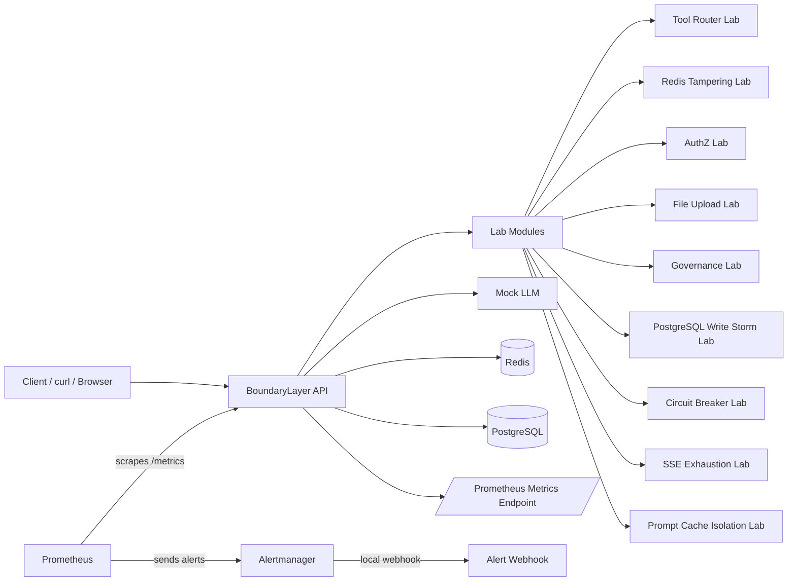
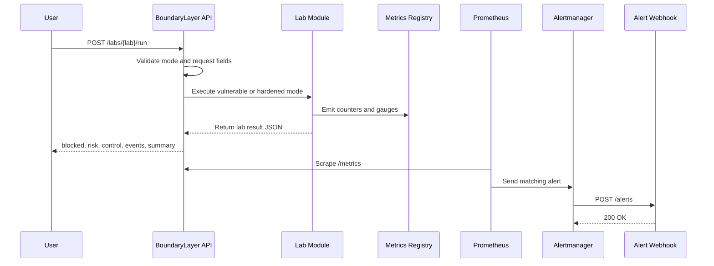
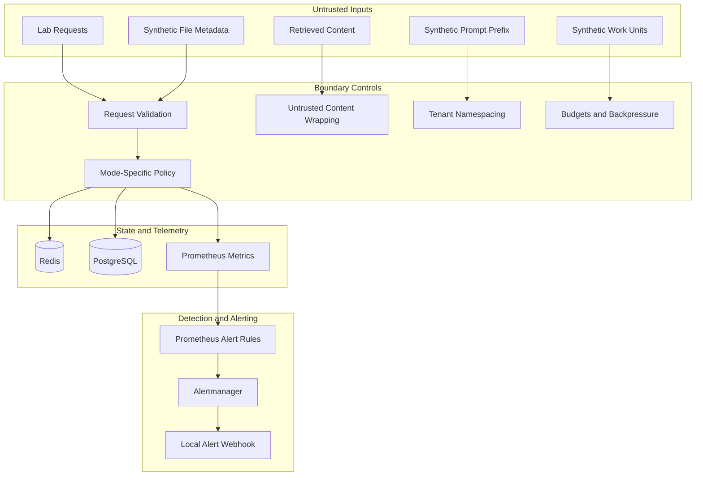
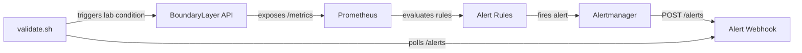

# Architecture Diagrams

Mermaid diagrams for BoundaryLayer system architecture, lab execution, trust boundaries, and observability.

## System Architecture

BoundaryLayer runs as a Docker Compose stack. The API orchestrates nine security labs and exposes Prometheus metrics. Alertmanager routes firing alerts to a local webhook for validation.

## Lab Execution Flow

Each lab request is validated, executed in vulnerable or hardened mode, and recorded in Prometheus metrics. Validation scripts confirm end-to-end alert delivery through the local webhook.

## Trust Boundary Model

Untrusted inputs cross validation and mode-specific policy before touching state or telemetry. Detection rules consume emitted metrics and route alerts locally.

## Observability Pipeline

The API exposes `/metrics`. Prometheus evaluates alert rules, Alertmanager routes matches to the webhook, and `validate.sh` confirms delivery after triggering a lab condition.

See [ARCHITECTURE.md](ARCHITECTURE.md) for service ports, metric names, and lab behavior details.
