# Architecture Diagrams

Mermaid diagrams for BoundaryLayer runtime topology, lab flows, trust boundaries, observability, and release validation. All diagrams reflect current v1.0.5 behavior.

See [ARCHITECTURE.md](ARCHITECTURE.md) for ports, metrics, and lab details.

## 1. System Architecture

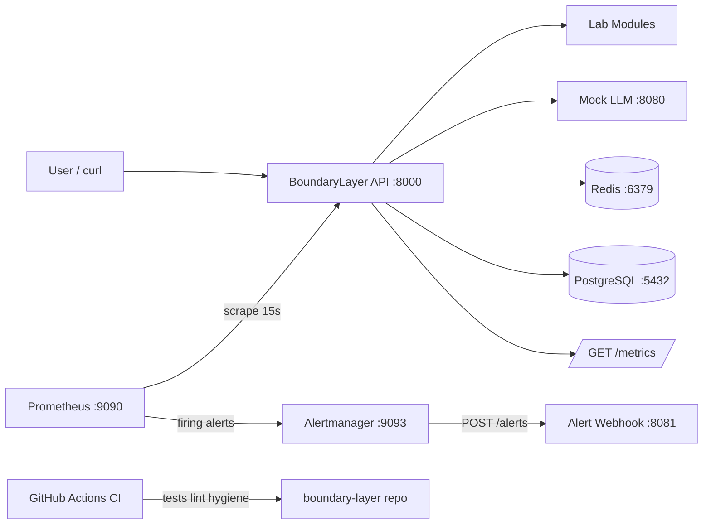

## 2. Docker Compose Runtime Topology

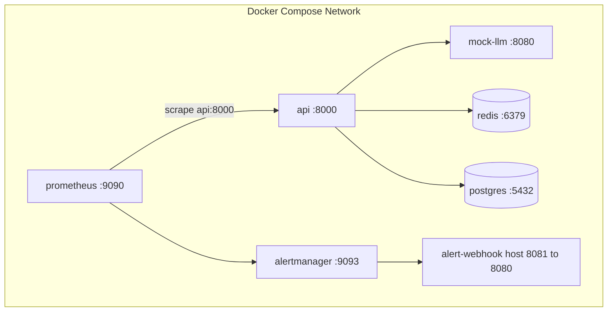

## 3. Lab Execution Sequence

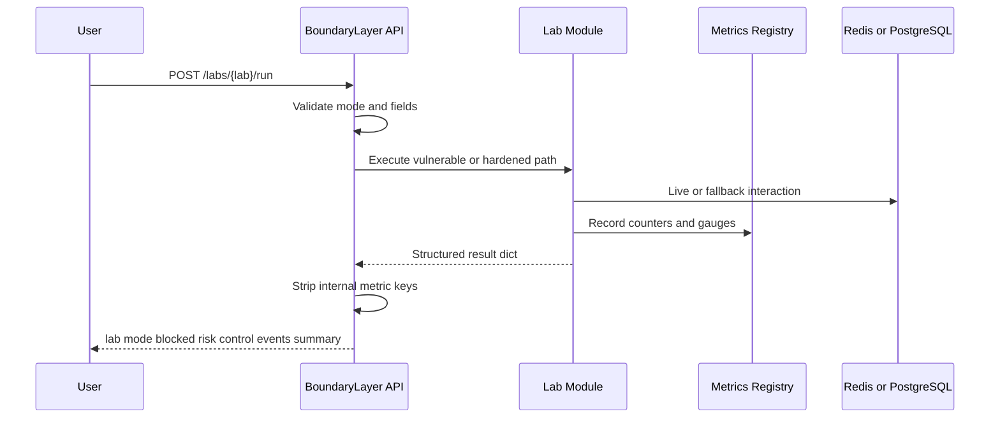

## 4. Observability and Alerting Pipeline

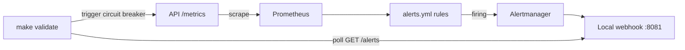

## 5. Trust Boundary Model

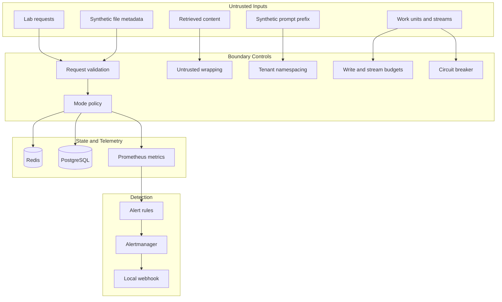

## 6. Redis State Tampering Flow

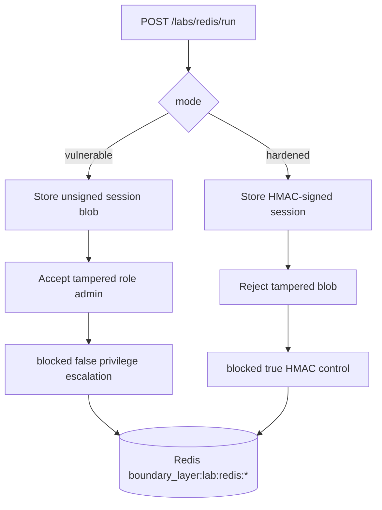

## 7. PostgreSQL Governance Flow

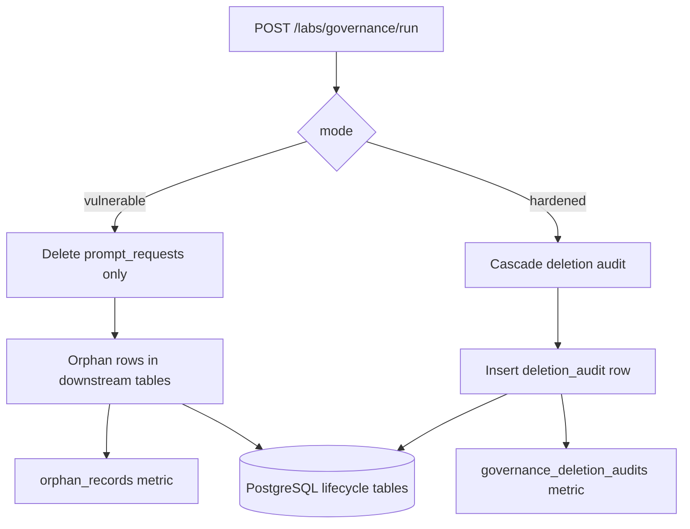

Downstream tables include `prompt_logs`, `tool_records`, `evaluation_queue`, and `training_queue`.

## 8. PostgreSQL Write Storm Flow

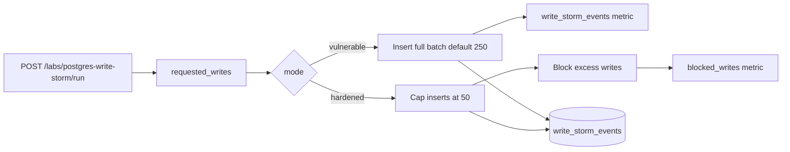

## 9. Circuit Breaker State Flow

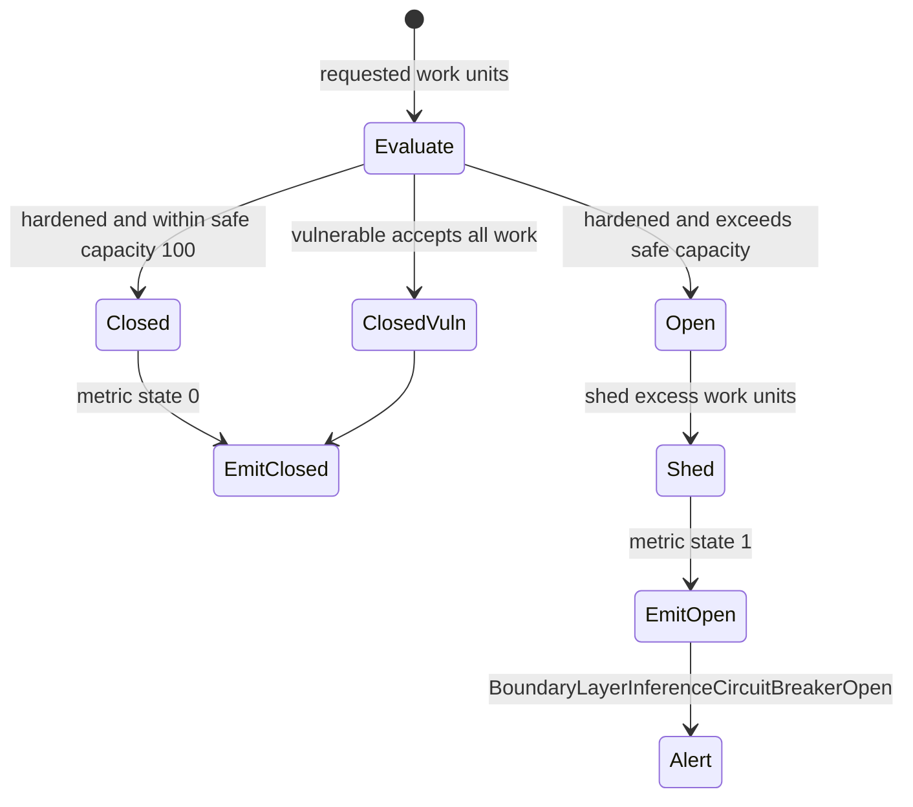

## 10. SSE Exhaustion Flow

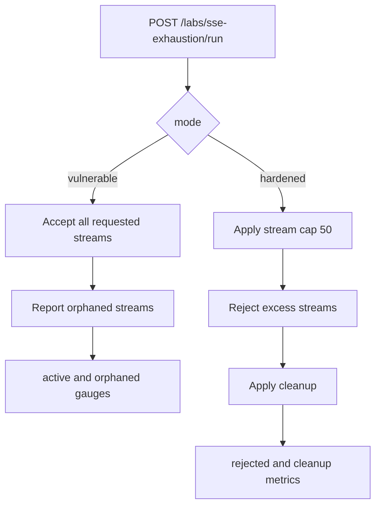

## 11. Prompt Cache Isolation Flow

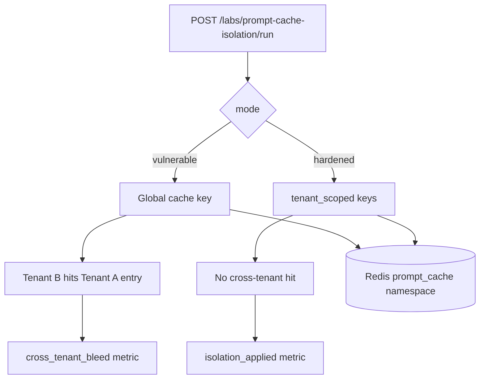

## 12. File Sandbox Hardening Flow

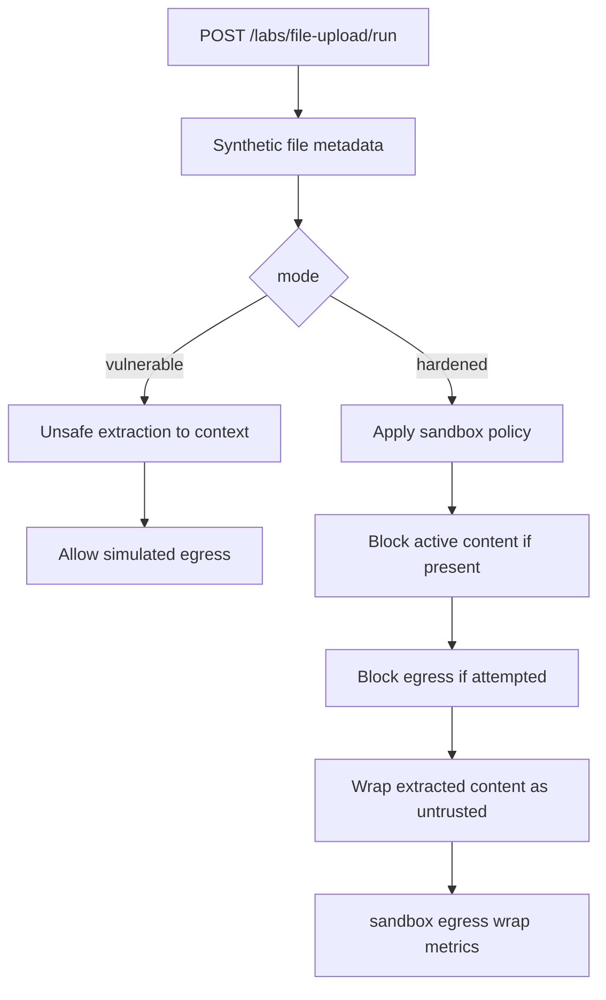

## 13. CI and Release Validation Flow

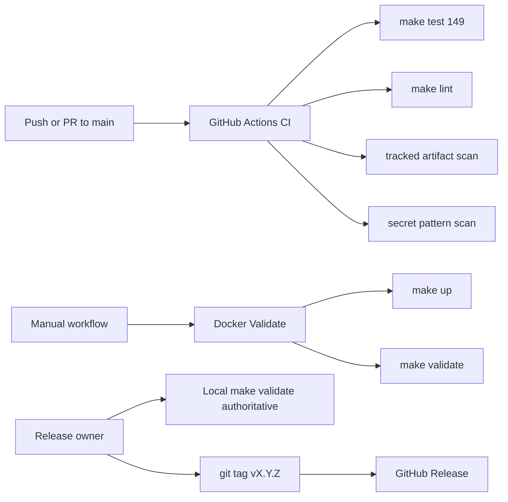
